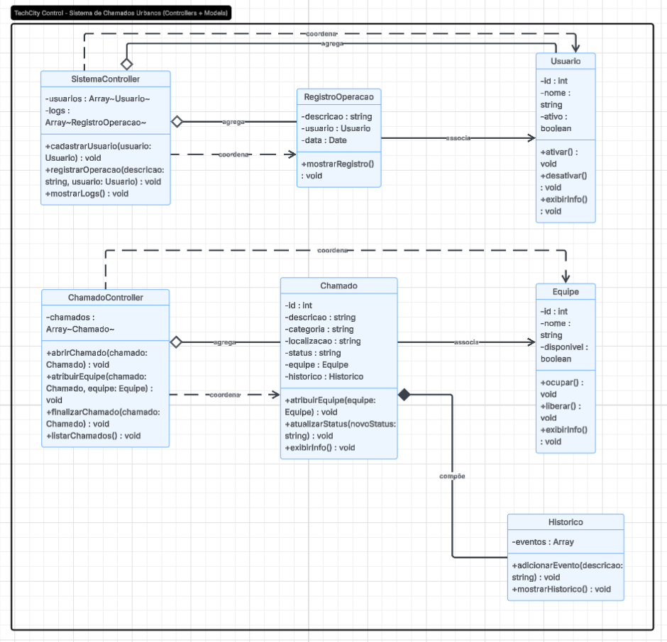

# 🏙️ TechCity Control

### Sistema de Chamados Urbanos — Módulo 5

Projeto desenvolvido para a disciplina de **Programação Orientada a Objetos (POO)** do curso **Técnico em Desenvolvimento de Sistemas** do **Instituto Federal de Alagoas (IFAL) – Campus Maceió**.

---

## 👨‍💻 Equipe

- **Vinícius Rodrigues da Silva**
- **Vitor Miguel Rocha Calheiros**
- **Álefe Matheus Silva dos Santos**

---

## 👨‍🏫 Professor Orientador

**Prof. MSc. Ricardo Nunes**

---

# 📖 Sobre o Projeto

O **TechCity Control** é uma plataforma voltada para o gerenciamento de serviços urbanos da cidade fictícia **TechCity**.

Nossa equipe ficou responsável pelo **Módulo 5 – Sistema de Chamados Urbanos**, cujo objetivo é registrar, organizar e acompanhar ocorrências reportadas pelos cidadãos, permitindo o gerenciamento das equipes responsáveis pelo atendimento.

O sistema possibilita o acompanhamento completo do ciclo de vida de um chamado, desde sua abertura até sua conclusão.

### Exemplos de ocorrências

- 💡 Falta de iluminação pública
- 🛣️ Buracos em vias públicas
- 🚰 Vazamentos
- 🧹 Problemas de limpeza urbana
- 🚧 Sinalização danificada

---

# 🎯 Objetivos

O sistema foi desenvolvido para:

- Registrar chamados urbanos;
- Cadastrar equipes responsáveis pelos atendimentos;
- Associar equipes aos chamados;
- Controlar a disponibilidade das equipes;
- Registrar operações realizadas no sistema;
- Manter histórico completo dos atendimentos;
- Acompanhar o status de cada ocorrência.

---

# ⚙️ Funcionalidades Implementadas

## 📌 RF01 — Registro de Chamados

Permite cadastrar chamados contendo:

- ID
- Descrição
- Categoria
- Localização
- Status

---

## 👷 RF02 — Cadastro de Equipes

Permite registrar equipes contendo:

- ID
- Nome
- Disponibilidade

---

## 🔄 RF03 — Associação de Equipes

O sistema permite:

- Verificar disponibilidade da equipe;
- Associar equipe ao chamado;
- Atualizar o status do atendimento.

---

## 📝 RF04 — Histórico de Atendimentos

Permite registrar:

- Criação de chamados;
- Alterações de status;
- Equipes atribuídas;
- Data e hora das operações.

---

# 🏗️ Arquitetura do Projeto

O projeto foi desenvolvido seguindo os princípios de **Programação Orientada a Objetos**, utilizando:

- Encapsulamento;
- Composição;
- Associação;
- Agregação;
- Separação de responsabilidades;
- Arquitetura baseada em Models e Controllers.

### Organização

**Models**
- Usuario
- Equipe
- Chamado
- Historico
- RegistroOperacao

**Controllers**
- SistemaController
- ChamadoController

---

# 📊 Diagrama de Classes UML

> Modelagem desenvolvida para representar as entidades, controladores e relacionamentos do sistema.



---

# 📁 Estrutura do Projeto

```text
TechCity-Control/
│
├── controllers/
│   ├── ChamadoController.js
│   └── SistemaController.js
│
├── models/
│   ├── Chamado.js
│   ├── Equipe.js
│   ├── Historico.js
│   ├── RegistroOperacao.js
│   └── Usuario.js
│
├── index.js
├── modelagem.png
└── README.md
```

---

# ▶️ Executando o Projeto

Certifique-se de possuir o **Node.js** instalado.

Execute o projeto com:

```bash
node index.js
```

---

# 📚 Conceitos de POO Aplicados

- Classes e Objetos
- Encapsulamento
- Métodos
- Composição
- Associação
- Agregação
- Modularização
- Controllers para coordenação das operações

---

# 📄 Licença

Projeto acadêmico desenvolvido exclusivamente para fins educacionais na disciplina de **Programação Orientada a Objetos (POO)** do **IFAL – Campus Maceió**.

---

✨ **TechCity Control — Conectando cidadãos e equipes para uma cidade mais organizada.**